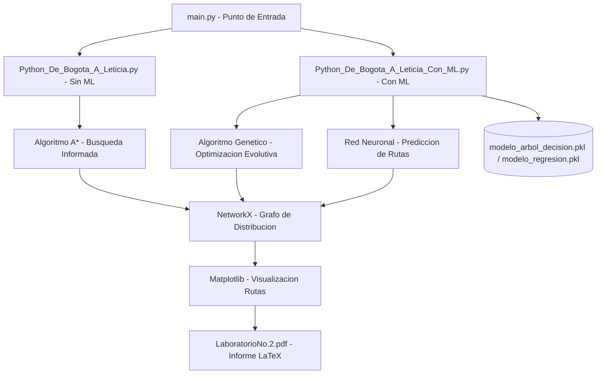

<div align="center">

# 📌 Optimización de Rutas con Algoritmos y Machine Learning  

## 📖 Descripción

</div>

---

Proyecto que implementa algoritmos de búsqueda informada para optimizar rutas de distribución en redes logísticas, minimizando costos y tiempos de entrega.

## 🛠️ Funcionalidades  
- Cálculo de rutas óptimas usando Algoritmo A* y Voraz.  
- Simulación de redes de distribución con diferentes condiciones.  
- Análisis de eficiencia con métricas de tiempo y distancia.  
- Visualización gráfica de las rutas generadas.  

## Arquitectura



## 🚀 Tecnologías utilizadas  
- Python  
- Algoritmos Genéticos  
- Redes Neuronales  
- Matplotlib y NetworkX para visualización  

## ▶️ Cómo ejecutar el proyecto  
1. Instalar dependencias:  
   ```bash
   pip install -r requirements.txt
   ```
2. Ejecutar el script principal:  
   ```bash
   python main.py
   ```
3. Analizar los resultados generados en la simulación.  

## 📌 Autor  
👨‍💻 **Alejandro De Mendoza**

---

## Autor

**Alejandro De Mendoza**  
Ingeniero Informático · Especialista en IA · Especialista en Ingeniería de Software · Máster en Arquitectura de Software

[](https://github.com/AlejoTechEngineer)
